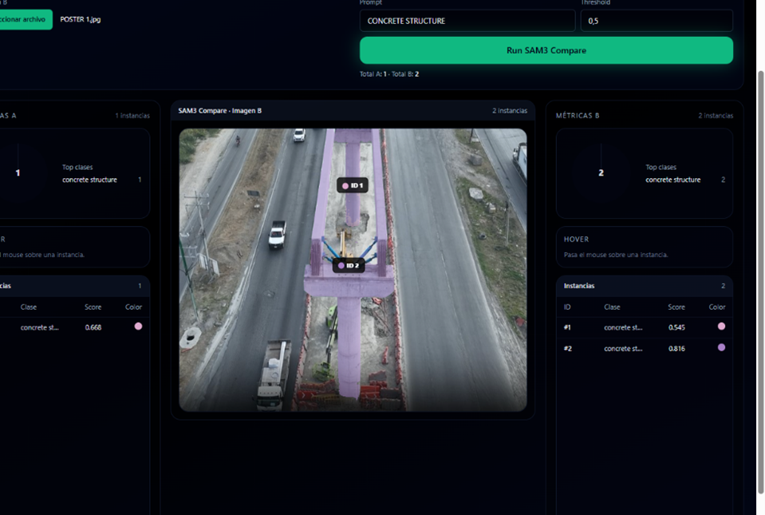
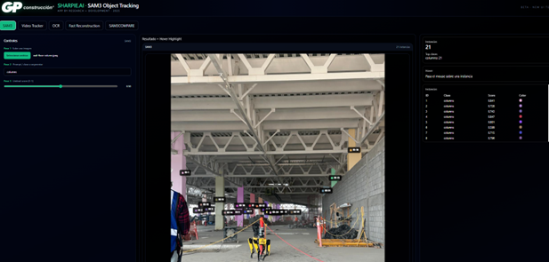
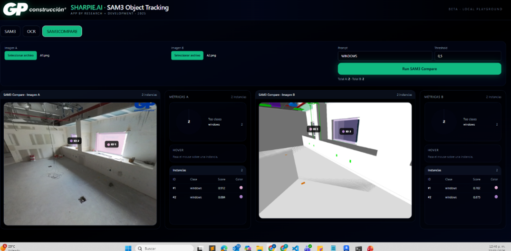
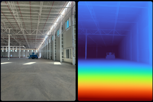
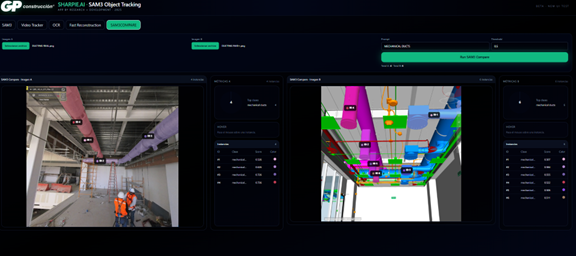
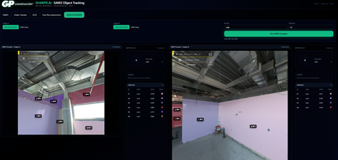
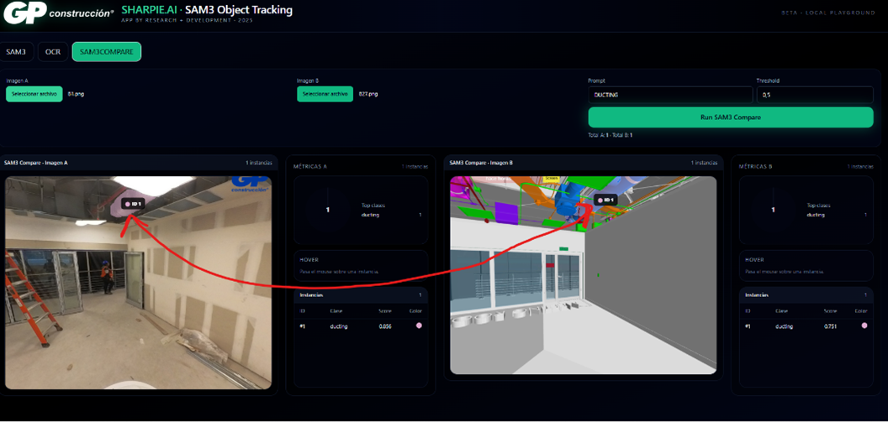

# SHARPIE.AI · SAM3 Object Tracking

> AI-powered visual intelligence toolkit for construction progress analysis, object segmentation, OCR extraction, video tracking, and rapid 3D reconstruction.

<p align="center">
  
</p>

<p align="center">
  
  
  
  
</p>

## Overview

**SHARPIE.AI** is a modular computer vision playground built for construction and VDC workflows. The current product combines five experience layers inside one interface:

- **SAM3** for prompt-based image segmentation and per-instance metrics.
- **SAM3 Compare** for side-by-side comparisons between field imagery and alternative references.
- **OCR** for extracting structured alphanumeric keys from photos and generating CSV outputs.
- **Video Tracker** for frame-based object search and tracking over video sequences.
- **Fast Reconstruction** for depth estimation and lightweight point-cloud generation from imagery.

The objective is not just inference, but a practical decision-support workflow for field verification, progress monitoring, QA/QC, and digital-twin alignment.

---

## Why this project matters

Construction teams generate thousands of visual records, but most remain unstructured. SHARPIE.AI converts images and videos into **queryable, measurable, and reviewable data**.

### Value delivered

- **Faster site interpretation** through natural-language segmentation prompts.
- **Visual comparison workflows** between as-built, design-derived, or alternative captures.
- **Text/key extraction** from labels, drawings, and tags with export-ready outputs.
- **Video-based discovery** to search for target objects across time.
- **Rapid geometry reconstruction** for quick 3D context from a single image.

---

## Core modules

### 1) SAM3 · Object Segmentation
Prompt-based segmentation over images with:
- instance-level IDs
- class counts
- confidence scores
- hover highlight interaction
- overlay generation
- session-based accumulation of counts

<p align="center">
  
</p>

### 2) OCR · Key Extraction
OCR flow focused on operational usability:
- batch image processing
- preview rendering
- confidence + status classification
- unique key aggregation
- CSV export for downstream reporting

<p align="center">
  
</p>

### 3) SAM3COMPARE · Visual Comparison
Parallel analysis for image A vs image B using the same prompt and threshold.
This is especially useful for:
- progress comparison
- field vs model evidence review
- change detection support
- consistency checks across capture sources

<p align="center">
  
</p>

### 4) Video Tracker
Processes a video, extracts frames, and enables search/segmentation across sampled frames.
Potential use cases:
- machinery tracking
- material flow observation
- event localization in long captures
- temporal evidence review

<p align="center">
  
</p>

### 5) Fast Reconstruction
Single-image depth reconstruction with optional `.ply` export and web-based point-cloud preview.
Useful for:
- quick geometry inspection
- lightweight scene understanding
- early as-built context generation
- bridge workflows toward scan-to-BIM and digital twin pipelines

<p align="center">
  
</p>

---

## Product gallery

| Interface | Preview |
|---|---|
| SAM3 main segmentation |  |
| SAM3 Compare · windows |  |
| SAM3 Compare · ducts |  |
| Model vs field MEP comparison |  |
| Drawing / plan segmentation |  |
| Depth preview |  |

---

## Technology stack

### Frontend
- React
- TypeScript
- Vite
- Tailwind CSS
- Three.js / React Three Fiber for 3D visualization

### Backend
- FastAPI
- NumPy
- Pillow
- OpenCV
- EasyOCR
- Torch / TorchVision
- Depth Anything V2-related dependencies

---

## High-level architecture

```text
User Interface (React + TS + Vite)
        |
        |  HTTP / multipart / JSON
        v
FastAPI Backend
  ├─ SAM3 segmentation routes
  ├─ OCR batch + stream routes
  ├─ Video processing + frame segmentation routes
  └─ Fast reconstruction routes
        |
        +--> image/video preprocessing
        +--> CV / OCR / depth inference
        +--> overlay / labels / previews / PLY
        |
        v
Result panels, galleries, CSV export, point-cloud viewer
```

---

## Suggested repository structure

```text
GP_VDC_SHARPIE_AI/
├─ backend/
│  ├─ main.py
│  ├─ sam3_engine.py
│  ├─ ocr_routes.py
│  ├─ video_routes.py
│  └─ ...
├─ frontend/
│  ├─ src/
│  │  ├─ App.tsx
│  │  ├─ api.ts
│  │  ├─ components/
│  │  └─ views/
│  ├─ package.json
│  └─ ...
├─ docs/
│  ├─ assets/
│  └─ deck/
├─ requirements.txt
└─ README.md
```

---

## Local setup

### Backend
```powershell
cd backend
python -m venv .venv
.\.venv\Scripts\Activate.ps1
pip install -r ..\requirements.txt
uvicorn main:app --reload --host 127.0.0.1 --port 8000
```

### Frontend
```powershell
cd frontend
npm install
npm run dev
```

Frontend default URL: `http://127.0.0.1:5173`

Backend default URL: `http://127.0.0.1:8000`

---

## Audit summary

This README was prepared after a quick code-and-UX audit of the repository and provided screenshots. The project already shows a strong product direction: unified UX, consistent visual language, and a differentiated value proposition for construction AI.

### Strengths observed
- Clear product modularity.
- Strong visual identity for internal/commercial demos.
- Practical construction use cases already visible in the UI.
- Good separation between frontend views and backend services.
- 3D preview capability adds a strong differentiator.

### Recommended technical improvements
- Consolidate backend app bootstrapping into a single `FastAPI()` instance.
- Add a **root README** replacing generic template content.
- Add environment-variable documentation and startup scripts.
- Formalize folder structure for docs, demo assets, and sample media.
- Add architecture diagram and roadmap section directly in the repo.
- Add issue templates and contribution guidance for internal team scaling.

---

## Known audit findings

### 1) Root documentation gap
The repository currently exposes a strong product, but the visible README template in the frontend still reads like the default Vite starter. Replacing it with project documentation is a high-value improvement for stakeholders, new developers, and commercial demos.

### 2) Backend bootstrap risk
`backend/main.py` appears to instantiate `FastAPI()` more than once. That pattern can accidentally override prior router registrations or app metadata if not consolidated carefully. This should be cleaned before production hardening.

### 3) Product narrative is stronger than current repo narrative
The UI and screenshots already communicate a serious platform vision; the repository should match that quality with polished documentation, architecture notes, and demo-ready storytelling.

---

## Roadmap direction

### Short term
- Harden main backend entrypoint.
- Add root README and deck.
- Standardize startup instructions.
- Organize assets under `docs/assets`.

### Mid term
- Add benchmark cases and demo datasets.
- Add model/config management.
- Persist sessions and experiment logs more formally.
- Improve compare and tracking analytics.

### Long term
- Connect outputs to BIM / VDC pipelines.
- Add model-to-field comparison workflows.
- Enable reporting/export packs.
- Move toward commercial deployment architecture.

<p align="center">
  
</p>

---

## Commercial positioning

SHARPIE.AI is not only an AI demo. It is a **construction intelligence interface** with real potential across:
- progress monitoring
- quality control
- evidence capture
- digital-twin support
- object inventorying
- field-to-model comparison

For internal innovation teams, this repo can function as:
- a demo platform,
- a product incubation environment,
- and a base for future enterprise workflows.

---

## License / internal use

Add the correct internal or commercial license statement here.

Example:

```text
Copyright (c) GP Construcción / GP VDC.
All rights reserved.
Internal use only unless otherwise authorized.
```

---

## Contact / ownership

**Research + Development / VDC**

For roadmap, demo, or implementation discussions, add the responsible owner/team section here.

---

## Final note

This project already has the ingredients of a highly compelling internal platform. The next leap is not only technical maturity, but also **repository maturity**: narrative, onboarding, architecture clarity, and presentation quality.

That is what this README is designed to accelerate.
